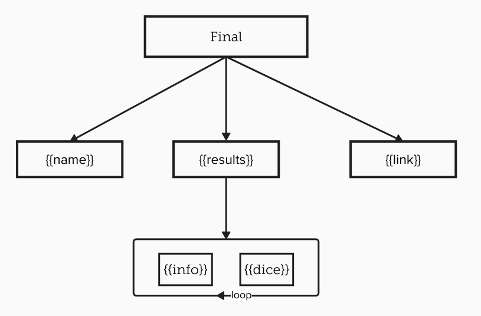

:::tip
To open a context menu, right-click (or long press on mobile) on a message, then select `Application`.
:::

# Create a Link to a Result

This command allows you to generate a direct link to a dice roll result from the bot. Useful for sharing a specific result in another channel or with another user.

This command can be customized in two ways:
- Per user, for each server, using `/user_config create_link`
- Per server, by administrators, using `/config create_link`

:::important
The server format takes priority over the user format.
:::

## Format

:::usage
**`/config create_link format [final] (results) (dice) (info) (name) (original_dice) (character) (join_results)`**
- `dice`: The raw dice result, usually `[RES](SIGN)(COMPARISON)`, for example `[29]>=10`.
- `info`: The information text, such as critical (including custom), failure, or success messages.
- `name`: The name of the statistic or macro, if one is found.
- `join_results`: The text used to join multiple results together.
- `results`: A list that contains the combination of `dice` and `info`, joined using the `join_results` variable.
- `final`: The final format that combines variables to build the link.
- `original_dice`: The original dice rolled, for example `1d100`.
- `character`: The name of the character who rolled the dice.
:::

:::warning
Discord does not allow trailing (or leading) spaces in options. If you want to add a space at the beginning or end of a variable, use `\s` to represent a space.
:::

When variables are left empty, default values are used.

### Variables

To simplify format creation, you can use the following variables in your format fields:
- `{{dice}}` : Dice result (example: `[29]>=10`)
- `{{info}}` : Information text (example: `Critical Failure`)
- `{{name}}` : Statistic or macro name (example: `Strength`)
- `{{results}}` : List combining multiple `{{dice}}` and `{{info}}`
- `{{link}}` : Link to the message containing the dice result
- `{{original_dice}}` : The original dice rolled (example: `1d100`)
- `{{character}}` : The name of the character who rolled the dice

There are certain customizations possible for `name`, `info`, and `character` by adding `:short` or `:long` after the variable name:
- `:short` : Provides the initials of the variable only if it consists of at least two words. For example, for `{{name}}`, if the name is `Strength Test`, `{{name:short}}` will yield `ST`.
- `:long` gives the same result as the absence of this option, providing the full variable.

#### Results (`{{results}}`)
The `{{results}}` variable is actually a list joined using the variable `results_join`. This variable **can only** contain:
- `{{dice}}`
- `{{info}}`
- `{{original_dice}}`

#### Final
The `final` variable may only contain `{{results}}`, `{{link}}`, and `{{name}}`.



### Default

By default, the format is defined as follows:
- Final: `[[{{name}}{{results}}]](<{{link}}>)`,
- Results: ``{{info}} `{{dice}}` ``,
- Results join: `; `,
- Dice: `{{dice}}`,
- Info: `{{info}} - `,
- Name: `__{{name}}__: ` ,

Which gives: ``[[__Name__ :  Critical Failure - `[29] ⩾ 10`]](<https://discord.com/channels/guildId/channelId/messageId>)``


## Display

:::usage
**`/config create_link display`**
:::

Displays the list of the current link formats for the server, along with an example based on the following format:

```
__**Character**__ (<@000000000000000000>)  (\`>= 11\`):
[__Nom__]
  **Critical Failure** — \`1d100\` ⟶ \`[29]\` = \`[29] ⩾ 10\`
```

## Reset
:::usage
**`/config create_link reset`**
:::

Resets the link format to its default values.
