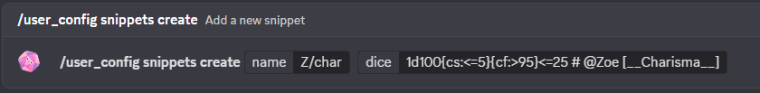
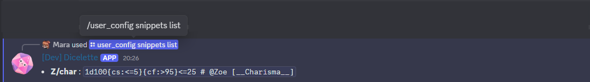
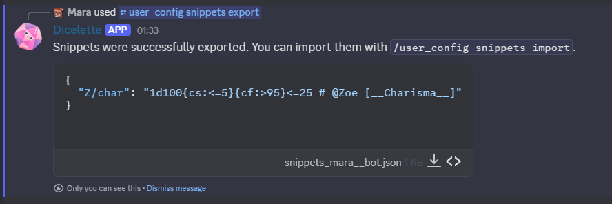
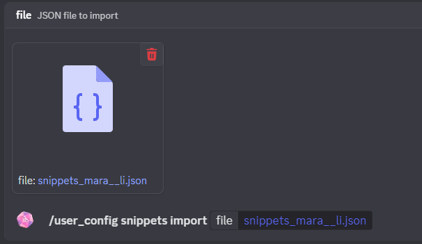
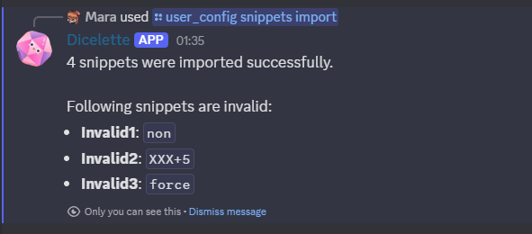

`Snippets` are reusable dice that are not tied to any character or specific model. They can be created and used by users to simplify frequent dice rolls, without needing to configure a model.

## Creating snippets (`/user_config snippets create`)

:::usage
**`/user_config snippets create [name] [dice]`**
- `name`: Name of the snippet
- `dice`: Dice to be rolled (e.g. `1d20+5`)
:::

:::important
Stats are not supported in snippets, because they are not linked to a character.
:::

If the snippet already exists, its dice value will be updated.

## Deletion (`/user_config snippets delete`)

:::usage
**`/user_config snippets delete [*name]`**
- `*name`: Name of the snippet to delete
:::

Allows you to delete an existing snippet from the list.

## Listing snippets (`/user_config snippets list`)
:::usage
**`/user_config snippets list`**
:::

Displays the list of existing snippets for the user.

## Exporting snippets (`/user_config snippets export`)
:::usage
**`/user_config snippets export`**
:::
Allows you to export all user snippets in JSON format, for backup or sharing elsewhere.

## Importing snippets (`/user_config snippets import`)
:::usage
**`/user_config snippets import [file]`**
- `file`: JSON data of snippets to import
:::

Allows you to import snippets from a JSON file, enabling users to easily transfer or share their snippets across different servers or accounts.

