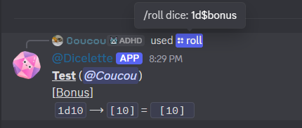
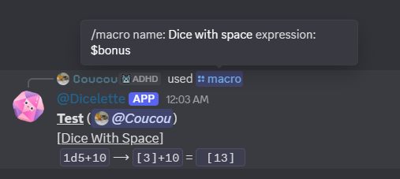
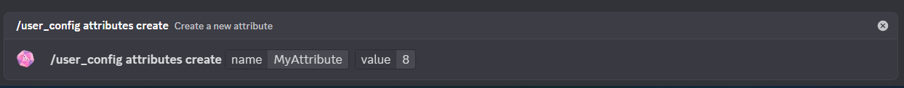
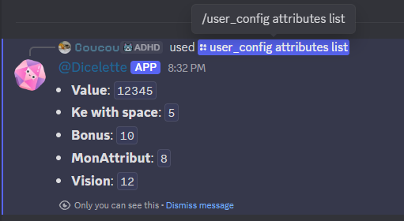
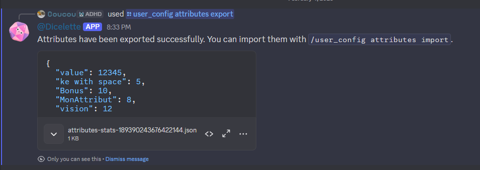
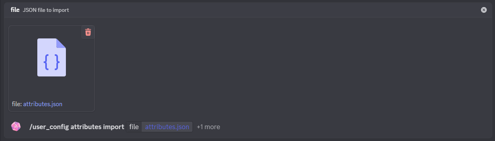
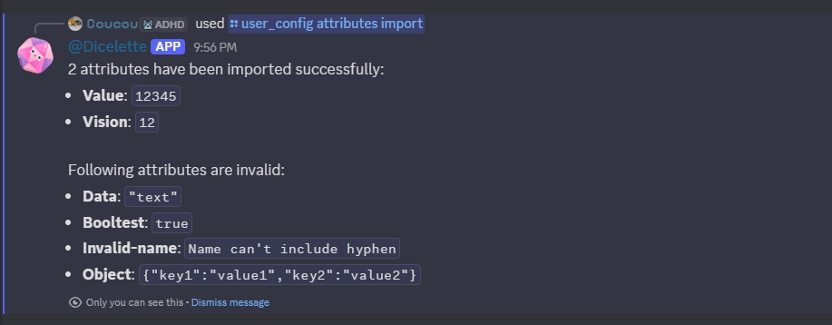

<mark>Attributes</mark> allow each user to define and manage specific numerical attributes for a server, without the need to configure a template or accompany the template.

:::warning
If a record has statistics, the attributes are added to it, but the statistics replace attributes with the same name.
:::

:::tip
Attributes doesn't allow to enable and use `/dbroll`, `/macro`, `/display` and `/calc` without a configured template.
:::

# Usage

Unlike [snippets](snippets.md), attributes cannot be used directly. They function as shortcuts (similar to statistics) in the form of keys. In practical terms, this allows the **name** of an attribute to be used in a die roll, prefixed with the `$` symbol.

:::example[`1d$force`]
When `force` is `12`, the die is automatically converted to `1d12`.
:::

This syntax can be used:
- In `/roll` roll commands
- In [direct notation](../../usage/message.md)
- In roll commands linked to character sheets (`/dbroll`, `/macro`) as well as their equivalent in `/mj`.
- In `/calc` and `/math` commands (only on a server)

:::tip
As with snippets, each key must be unique. It is recommended to use:
- short names;
- without spaces (if a space is used anyway, the value remains accessible by replacing spaces with `_` or `.`).
- without `-` (hyphen) because they can be confused with negation (`$myStat-10`)
:::

:::warning
Attributes are stored globally at the server level and are therefore shared between all characters belonging to the same player.
:::

:::danger
To be used in a snippet or a macro, an attribute must first be registered.
:::

# Creating an attribute

:::usage
**`/user_config attribute create [name] [value]`**
- `name`: Name of the attribute
- `value`: Number to be recorded
:::

As with snippets, if the attribute already exists, its value will simply be updated.

# Deletion

:::usage
**`/user_config attributes delete [*name]`**
- `*name`: Name of the snippet to be deleted
:::

Allows you to delete an existing attribute from the list of attributes.

# Listing attributes

:::usage
**`/user_config attributes list`**
:::

Displays the list of existing attributes for the user.

# Export attributes

:::usage
**`/user_config attributes export`**
:::

Exports all user's attributes in JSON format so that they can be saved or shared.

# Import attributes

Imports attributes from a JSON file. This allows you to easily transfer or share data between different servers or accounts.

:::usage
**`/user_config attributes import [file] (?overwrite)`**
- `file`: JSON data of the attributes to be imported
- `?overwrite`: Allows you to overwrite the data rather than merge it with the old data.
:::

By default, the data is merged. If two attributes have the same name, the imported attribute will replace the existing one.
During import, the attributes are validated and only those that comply will be added.

