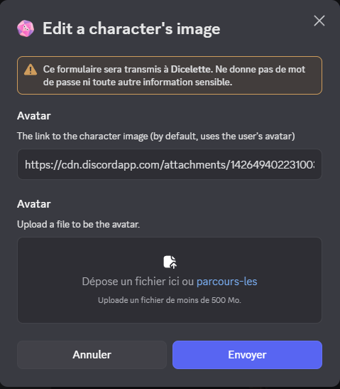

### Edit user data


Each tree commands will open a modal to edit the corresponding data.

If you are using an old version of the bot, you will have to use the commands.

To add the new button.

#### Editing the avatar image



:::warning
Images stored on Discord cannot be used as their links change regularly. It is therefore mandatory to use external links, for example, by using [imgur](https://imgur.com/).
[See here for more information](https://www.bleepingcomputer.com/news/security/discord-will-switch-to-temporary-file-links-to-block-malware-delivery/).
:::

:::usage[Command]
**`/edit avatar [(url) (file)] (@user) (*character)`**
- `url`: URL of the image to use.
- `file` : Image file to upload.
- `@user`: User to edit if different from the one using the command.
- `*character`: Name of the character to edit. If not specified, the default character will be edited.
:::

By default, the commands will change the image of the person that used the commands. Only moderator can change the image of another user.

:::important
If both URL and file are provided, the file will take priority.
:::

Even as the two options are optional, at least one of them must be provided, or an error will be thrown.

#### Rename a character


As the command, it doesn't allow duplicate character name. Each character must have different name, or error will be thrown.

:::usage[Command]
**`/edit rename [new_name] (@user) (*character)`**
- `new_name`: New name of the character.
- `@user`: User to edit if different from the one using the command.
- `*character`: Name of the character to edit. If not specified, the default character will be edited.
:::

#### Move to another user


It will **move** the character to another user, deleting the one on the old user. An error will be thrown in case of duplicate, and action will be undone.

:::usage[Command]
**`/edit user [@new_user] (@old_user) (*character)`**
- `@new_user`: User to move the character to.
- `@old_user`: User to move the character from.
- `*character`: Name of the character to move. If not specified, the default character will be moved.
:::

### Editing Statistics


The modal will be pre-filled with a list as follows:
```md
- NAME: value
- NAME: value
- NAME: COMBINATION
```

:::warning
It is imperative to keep this list as is so that the bot can correctly read the statistics.
:::

You can remove values by using `X` or leaving it blank, like this:
```md
- NAME: X
```

If statistics have been removed from the template, they will be automatically removed from the list. Additionally, they will be automatically added back when the template add new statistics, with a default value of "0".

It is possible to modify combinations.

Finally, values will not be checked against the total initially recorded in the template. Game masters must therefore verify the values during editing.

:::note
If statistics are edited and logs are enabled, a modification message will be sent to the channel configured in the logs.
:::

### Editing Dice

Just like with statistics, the modal will be pre-filled with a list as follows:
```md
- NAME: dice
```

Just like during recording, dice will be evaluated to verify their validity. Additionally, you can add as many dice as you like!

As with statistics, it is essential to adhere to the list and its syntax. You can delete fields by replacing the value with "X" or "0".


