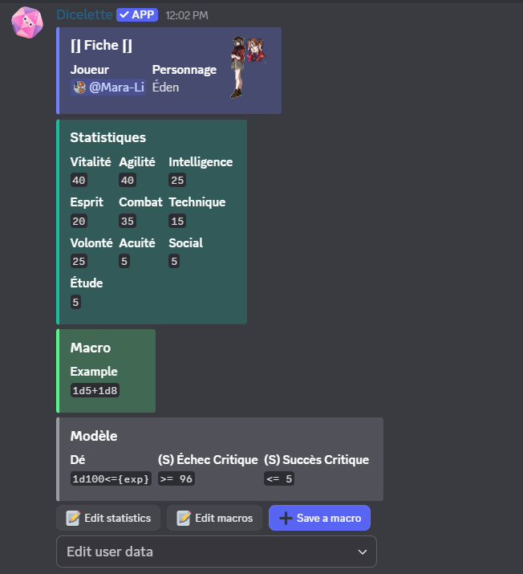

Once the user is validated, their character sheet will be automatically published in a thread or in the chosen channel. All character sheets will follow this format:

Only the template and the user will always be present, unless no die type and no critical success/failure have been recorded in the template.

If all information is saved, you will have access to three buttons:
- Edit user data : avatar (embed thumbnail), character name or move to another user,
- Edit Statistics
- Edit Macro (which allows saving multiple new dice, but shh...)
- Add a New Die.

:::important
If [self-registration](../../config/self_registration.md) is enabled **with** moderator approval, all proposed changes to a listing must be approved by a moderator before being applied. A message containing the proposed changes will be sent to the same chat room as the card; if a moderator approves the message, the changes are applied, otherwise they are rejected (and the user will be notified).  

The self-registration setting **alone** does not prevent editing of entries. To completely prevent users from editing their entries, place them in a chat room that is only accessible to moderators.
:::