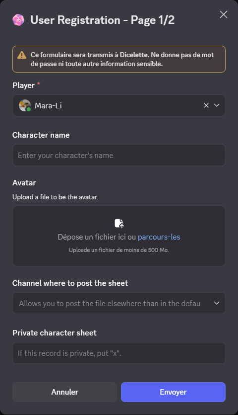

Now that the template has been created, you can register users. As we saw earlier, the template's embed contains a button **"Register a character ”**.

Once this button has been activated, you'll be presented with a series of forms to fill in.

## Main form

The first form is always the same, whatever the model:

- **Player** (*mandatory if moderation[^2]*): Select the user to be associated with the character. Pre-filled with the name of the person clicking.
- **Character name** (*required or optional depending on model*)  
- **Avatar** (*optional*): Link to the image to be used for the form. If empty, the player's avatar will be used.
- **Channel where to post the sheet** (*optional*): Allows you to send the form to a room other than those defined by the template (`private_channel` or `public_channel`). Leave blank to use default channels.
- **Private sheet** (*optional*): If enabled (see [private form](./model/index.md#next-steps)), allows you to choose whether the form should be private (`x` if yes, empty otherwise).  

:::warning
The listing can be hidden **only** if the `private_channel` option is enabled: even if the listing is sent to a channel inaccessible to others, they will be able to view it if this option is not enabled.
:::

## Statistics form

The following form(s) depend on the model:  
- If more than five characteristics are present, several pages will be displayed.
- At each step, simply enter the value of the requested statistic (min/max controls and number).

## Registered dice

Once registration is complete (all statistics filled in), you can add specific dice for this character.

Each dice must be registered manually.

## Validation

Click on **"Validate ”** to finalize the form.  
The form will then be sent to the chosen salon (or to a thread named `📝 - [STATS]` if no salon is defined or accessible).

## Important reminders

- [Form field syntax and auto-completion](../introduction/format.md)
- If [auto-registration](../config/self_registration.md) is enabled and a non-moderator clicks on the button, he'll only be able to register one character for himself.

[^1]: It is possible to use a forum, which will automatically create a post for the character. The player (as well as the administrators) will be mentioned in the post. 
[^2]: The “username” field is not present if [auto_registration](../config/self_registration.md) is enabled and a non-moderator has clicked on the button.